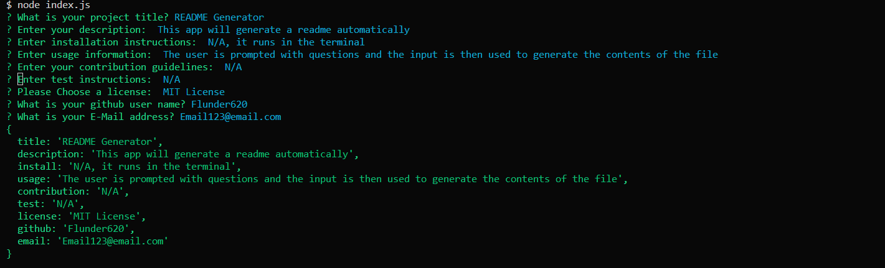

# README Generator

## Description

This application automatically creates a README.md file

## Installation

N/A, It's ran in the terminal

## Usage

The user is prompted with questions and the input is then used to populate the README.md file.

## Mock-Up

The following image shows the web application's appearance and functionality: 

## Video Example Link

https://drive.google.com/file/d/138gnAFnAcDXCuKq3UR53-c1T5vhSuPk2/view?usp=drive_link